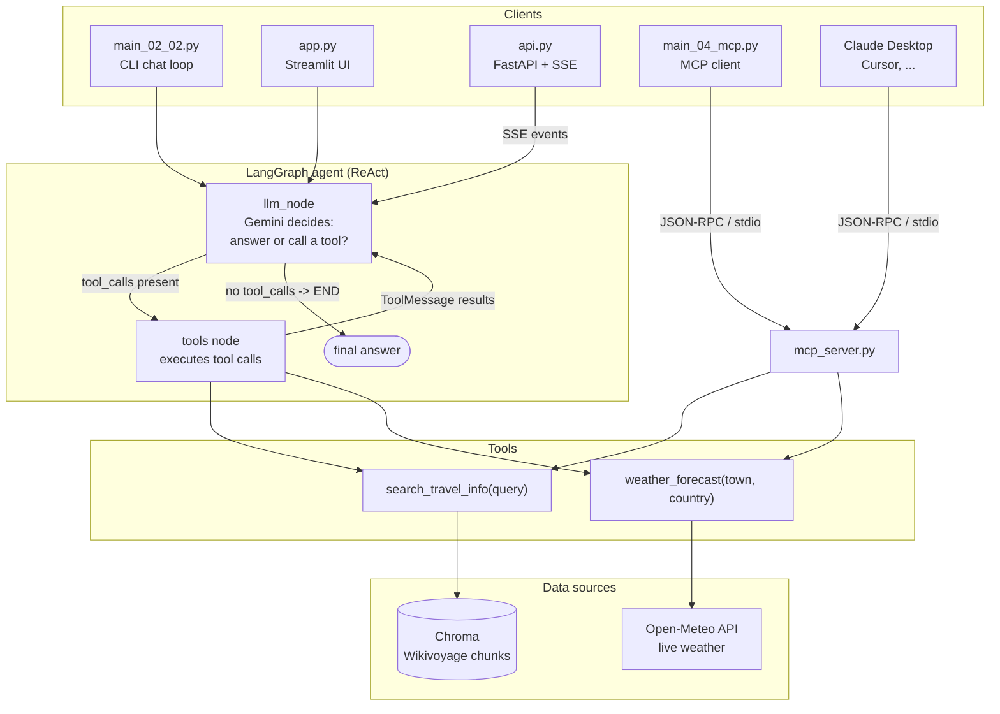

# 🏖️ Cornwall Travel Agent — a tool-calling LLM agent (LangChain · LangGraph · MCP)

[](https://github.com/Hieuxuan1112/travel-ai-agent/actions/workflows/ci.yml)


A ReAct agent that answers travel questions about Cornwall by combining **two tools**:
semantic search over a Wikivoyage knowledge base, and **live weather** for any city on
earth. The agent decides by itself which tool to call, in what order, and how many times —
nothing about the sequence is hardcoded.

> Built from Chapter 11 of *AI Agents and Applications With LangChain, LangGraph, and MCP*,
> then extended with a real weather API, an MCP server, a streaming web UI and an
> evaluation harness.

```
You: Suggest two Cornwall beach towns with nice weather
   [tool] search_travel_info({'query': 'beach towns in Cornwall'})
   [tool] weather_forecast({'town': 'Newquay', 'country': 'United Kingdom'})
   [tool] weather_forecast({'town': 'St Ives', 'country': 'United Kingdom'})
Assistant: Two beach towns with clear skies right now are St Ives (12.9 °C) and
           Newquay (12.4 °C) ...
```

## Features

| | |
|---|---|
| 🔁 **ReAct loop, hand-wired** | The LangGraph graph (LLM node ⇄ tool node + conditional edge) is built from scratch in `main_02_02.py`, and again in three lines with `create_react_agent` in `main_03_01.py` — same behaviour, so you can see exactly what the prebuilt component does for you |
| 🔎 **Tool 1 — semantic search** | Wikivoyage pages → chunks → Gemini embeddings → Chroma, cached on disk so restarts are instant |
| 🌤️ **Tool 2 — live weather** | Open-Meteo geocoding + current conditions for any city worldwide, **no API key required**. A `country` argument lets the LLM disambiguate towns that share a name (Falmouth UK vs Falmouth US) |
| 🔌 **MCP server** | The same two tools are exposed over the Model Context Protocol, so any MCP client (Claude Desktop, Cursor, or `main_04_mcp.py`) can use them across a process boundary |
| 🌐 **HTTP API with SSE streaming** | FastAPI service exposing the agent: `POST /chat` for plain JSON, `GET /chat/stream` pushing `tool_call` / `tool_result` / `answer` events over Server-Sent Events as they happen, `/healthz` for probes, and auto-generated OpenAPI docs at `/docs` |
| 📈 **LLM-specific observability** | Prometheus metrics for request latency (p95), per-tool call counts / duration / error rate, token usage and **cost in USD** — scraped into Prometheus and rendered by a provisioned Grafana dashboard, all wired up in Compose |
| 🖥️ **Streaming web UI** | Streamlit chat that shows every reasoning step, tool call and tool result live, plus latency and tool-call counters |
| 🛡️ **Safe to expose publicly** | Per-IP sliding-window rate limiting returns `429` with `Retry-After` before a stranger can drain the API quota; health and metrics endpoints stay exempt so container probes never trip it |
| 📊 **Evaluated, not just demoed** | 8-case suite measuring tool-selection accuracy and answer quality (LLM-as-judge) → [`evals/results.md`](evals/results.md) |
| ✅ **Tested & linted in CI** | Unit tests run with no network and no API key (services are faked), ruff-clean, GitHub Actions on every push |

## Architecture



The key idea: **the graph never changes when tools change.** Swapping the mock weather
service for a real API, or moving the tools behind an MCP server, touched zero lines of
graph-wiring code.

## Quickstart

```bash
git clone https://github.com/Hieuxuan1112/travel-ai-agent.git
cd travel-ai-agent
python -m venv venv && venv\Scripts\activate      # Windows (use source venv/bin/activate elsewhere)
pip install -r requirements.txt
copy .env.example .env                            # then paste your key
```

Get a free Google AI Studio key at <https://aistudio.google.com/app/apikey> and put it in
`.env`. The weather tool needs no key at all.

```bash
python main_02_02.py                              # CLI chat, hand-built graph
python main_02_02.py "What is the weather in St Ives, Cornwall?"   # one-shot
python main_03_01.py                              # same agent, prebuilt ReAct component
python main_04_mcp.py                             # tools loaded over MCP instead of imported
streamlit run app.py                              # web UI at http://localhost:8501
python api.py                                     # HTTP API at http://127.0.0.1:8000
```

With the API running, `/docs` gives you an interactive OpenAPI page, `/` a minimal SSE
demo, and the stream is plain text you can watch with curl:

```bash
curl -N "http://127.0.0.1:8000/chat/stream?q=Suggest%20two%20Cornwall%20beach%20towns%20with%20nice%20weather"
```

```
event: tool_call
data: {"name": "search_travel_info", "args": {"query": "popular beach towns in Cornwall"}}

event: tool_call
data: {"name": "weather_forecast", "args": {"town": "St Ives", "country": "United Kingdom"}}

event: answer
data: {"text": "Two excellent beach towns in Cornwall are St Ives and Falmouth ..."}

event: done
data: {"tool_calls": 3, "elapsed_seconds": 9.75}
```

Events arrive as the agent works, not batched at the end — the whole point of SSE.

### The whole stack, including monitoring

```bash
docker compose up --build
```

| | |
|---|---|
| http://localhost:8000/docs | API docs (and `/` for an SSE demo page) |
| http://localhost:8501 | Streamlit UI |
| http://localhost:9090 | Prometheus |
| http://localhost:3000/d/travel-agent | Grafana dashboard (no login needed) |

The dashboard tracks what actually matters for an LLM system — p95 latency, tool call
rate and per-tool p95, tool error count, token throughput, and cumulative spend. Measured
on a real run: **p95 7.55 s**, **$0.0035 across 5 requests** (~$0.0007 per question).

The prebuilt vector store ships in the repo (3.3 MB), so there is nothing to download or
embed on first run — delete `chroma_travel_info/` if you want it rebuilt from Wikivoyage.

### Deploy

`docs/DEPLOY_HF.md` walks through publishing this as a free public Space on Hugging Face
(no credit card): the image already runs non-root on the uid Spaces expects, carries the
vector store so cold starts serve immediately, and rate-limits callers per IP.

### Use the tools from Claude Desktop

Add this to `claude_desktop_config.json` and the two tools show up in any conversation:

```json
{
  "mcpServers": {
    "cornwall-travel": {
      "command": "D:\\path\\to\\repo\\venv\\Scripts\\python.exe",
      "args": ["D:\\path\\to\\repo\\mcp_server.py"],
      "cwd": "D:\\path\\to\\repo"
    }
  }
}
```

## Docker

```bash
docker compose up --build     # API on :8000, Streamlit UI on :8501
```

Multi-stage build (deps installed in a builder stage, only the resulting venv is copied
into the runtime image), runs as a non-root user, ships a `HEALTHCHECK` that polls
`/healthz`, and reads `$PORT` so the same image runs unchanged on Cloud Run. Compose
wires both services to one named volume holding the vector store, so restarts don't
re-embed, and gates the UI on `condition: service_healthy` to avoid two processes
building the store at once.

Notes for anyone reading the image: 1.4 GB (Chroma pulls in onnxruntime), first build
~4 min, rebuilds after a code change ~15 s thanks to layer ordering.

## Evaluation

`python evals/eval_agent.py` replays a fixed question set, reads the real message history
to see which tools the agent actually called, and has a second LLM grade each answer.

| Metric | Result |
| --- | --- |
| Tool-selection accuracy | **100%** (8/8) |
| Answer quality (LLM-as-judge, 1–5) | **4.4** |
| Average latency | 10.4 s |

Full per-question breakdown: [`evals/results.md`](evals/results.md).

## Tests

```bash
pytest tests -q      # 7 tests, no network, no API key needed
ruff check .
```

The weather service is exercised through a faked `requests.get`, including the
same-name-town disambiguation and the "tool failure returns a structured error instead of
raising" contract that lets the LLM recover on its own.

## Project layout

```
main_02_02.py      agent with the graph built by hand (LLM node, tool node, conditional edge)
main_03_01.py      same agent via create_react_agent
main_04_mcp.py     agent that loads its tools over MCP
mcp_server.py      MCP server exposing the two tools
api.py             FastAPI service: JSON endpoint + SSE stream + /metrics + OpenAPI docs
metrics.py         Prometheus metric definitions (latency, tools, tokens, cost)
monitoring/        Prometheus scrape config + provisioned Grafana dashboard
app.py             Streamlit UI with live reasoning trace
evals/             evaluation harness + results
tests/             unit tests (offline)
docs/graph.png     agent graph rendered by LangGraph
HUONG_DAN.md       Vietnamese walkthrough of the architecture
docs/MENTOR.md            Vietnamese full guide: architecture, flow, trade-offs, interview Q&A
docs/HOC_FASTAPI_SSE.md   Vietnamese deep-dive on the API and SSE layer
docs/HOC_DOCKER.md        Vietnamese deep-dive on the Docker/compose setup
docs/HOC_PROMETHEUS.md    Vietnamese deep-dive on metrics, PromQL and Grafana
docs/DEPLOY_HF.md         step-by-step deploy to Hugging Face Spaces (free, no card)
deploy/                   Space metadata generator
Dockerfile                multi-stage, non-root, healthcheck, $PORT-aware
docker-compose.yml        api + ui sharing one image and one vector-store volume
```

## Stack

Python 3.12 · LangChain 1.3 · LangGraph 1.2 · Gemini (`gemini-3.1-flash-lite` +
`gemini-embedding-001`) · Chroma · MCP 1.29 · FastAPI · uvicorn · Prometheus · Grafana ·
Docker Compose · Streamlit · pytest · ruff · GitHub Actions

## Credits

Chapter 11 of *AI Agents and Applications With LangChain, LangGraph, and MCP* for the
original single-tool → multi-tool walkthrough. Travel content from
[Wikivoyage](https://www.wikivoyage.org) (CC BY-SA), weather from
[Open-Meteo](https://open-meteo.com) (CC BY 4.0).
